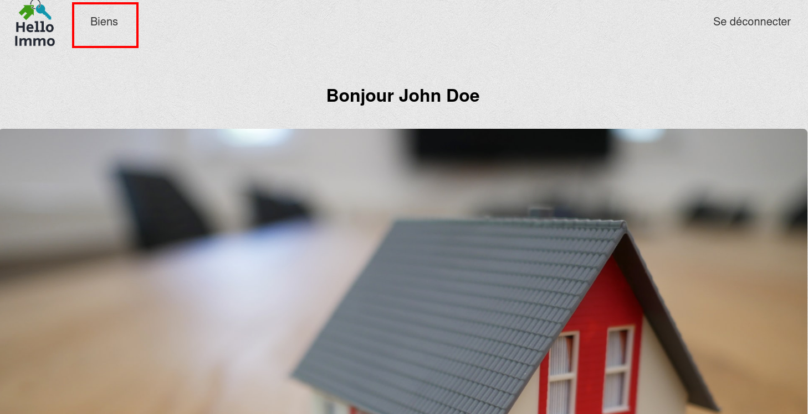
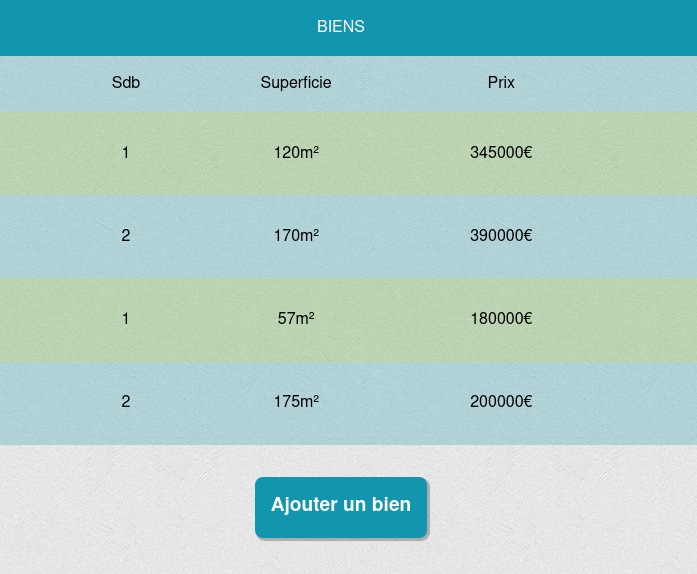
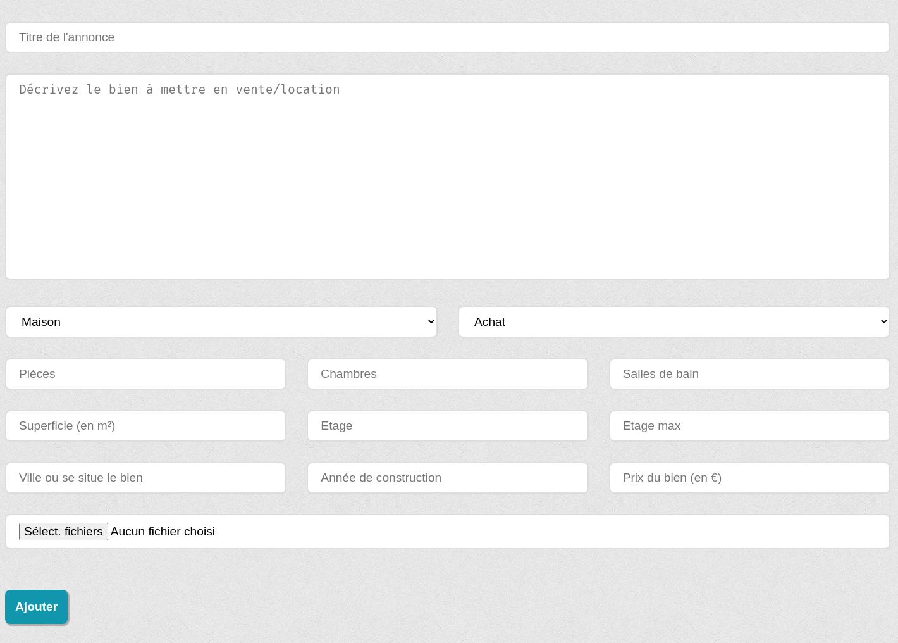
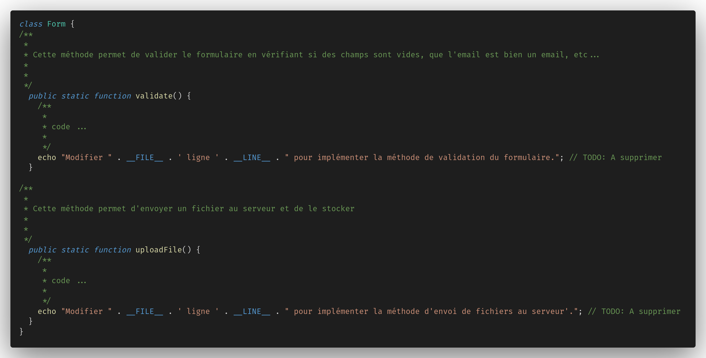
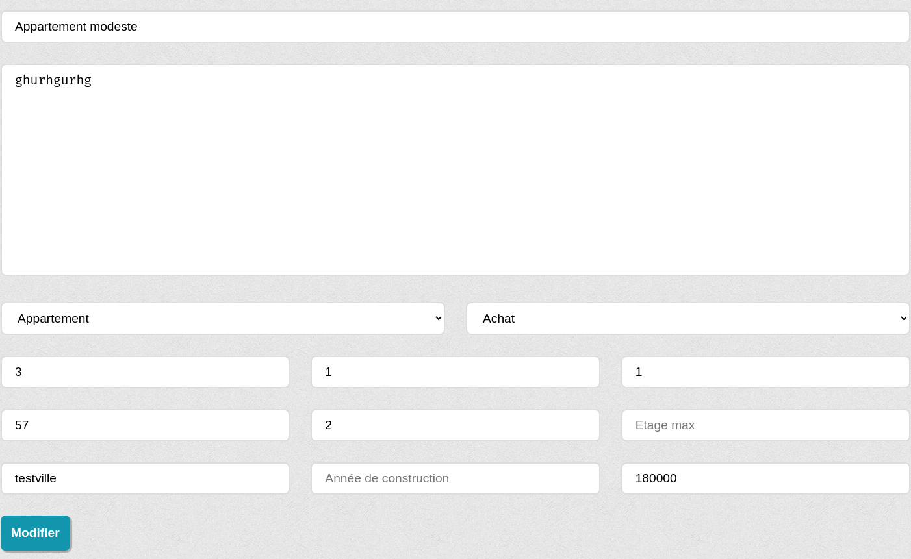
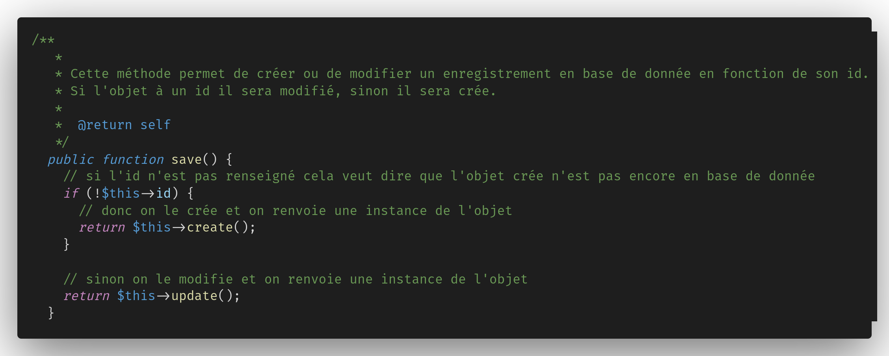

# Hello Immo CRUD

## TOPO

Au programme aujourd'hui: on met en place une opération de **C**(reate) **R**(ead) **U**(pdate) **D**(elete) pour une agence immobilière.

Le but sera de permettre à l'administrateur d'afficher les annonces disponibles depuis son espace administrateur, ajouter des annonces, modifier des annonces et supprimer des annonces.

L'ancien dev back ayant gentillement été remercié (après une histoire plutôt... louche 😬), c'est à nous que reviens cette tâche.

L'intégration des pages à déjà été faite par l'intégrateur, il ne nous reste plus qu'a coder la logique côté serveur ! Pas mal non ?
Pour ce faire, des routes ont déjà été définies et les méthodes qui y sont associées aussi (ne pas hésiter à aller regarder la page `index.php` pour voir quelle méthode est associée à quelle route). Le modèle pour les biens à lui aussi été crée, il est cependant incomplet mais les méthodes ont été crées.

Notre travail va donc être de venir remplir ces méthodes avec du code pour accomplir notre but principal qui est donc un CRUD pour les biens de l'agence ! 🎉

---

### R pour Read

Tout d'abord on doit pouvoir permettre à l'administrateur de visualiser les biens disponibles sur le site par le biais de son interface admin en cliquant sur le lien "Biens"

La route est déjà en place (`GET /admin/biens`), il ne nous reste plus qu'a implémenter la logique pour récupérer tous les biens dans le controller `EstateController` et de les envoyer à la vue pour les afficher (la vue est déjà crée à cet endroit `"views/admin/estates.twig"`). Pour récupérer tous les biens on va se servir du modèle `Estate` qui va se charger de faire la requête SQL pour récupérer les données stockés en base de donnée. Ce modèle contient déjà quelques méthodes qui pourraient nous aider comme `find`.

> Méthode du controller à modifier

> Recap

- route: `/admin/biens`
- modèle: `Estate`, méthode: `find`
- vue: `views/admin/estates.twig`
- controller: `EstateController`, méthode: `GetAdminEstates`

---

### C pour Create

Pour la partie création on va avoir un petit peu plus de travail, trois fois rien... 😏

Si l'étape précédente s'est bien passée on devrait avoir accès au bouton pour ajouter un bien.

En cliquant sur ce bouton on va être redirigé sur la page d'ajout d'un bien par la route `/admin/biens/ajouter`. La méthode associée à cette route devra renvoyer la page située à cet endroit `"views/admin/add-estate.twig"`.

En tant que développeurs back, ce qui nous intéresse ici c'est la validation de ce formulaire côté... **back** justement 😁.
A l'envoi (aka validation/soumission) du formulaire, il va falloir vérifier les points suivants:

- Que tous les champs obligatoires soient remplis (au risque de se prendre un crochet du droit par notre chère base de donnée sous MySQL 🥊).
- Que tous les champs numériques (étage, chambres, salle de bains, prix, etc...) contiennent bien des valeurs numériques.

Pour ça on pourra se servir de la class `Form` qui contient une méthode `validate` prévue à cet effet, malheureusement le dev back n'a pas eu le temps de l'implémenter... (la tuile ! 😬) C'est donc à nous de le faire !

Une fois que cette méthode est implémentée (en essayant au maximum de garder un code propre 😬) il faudra vérifier si on a eu des erreurs suite à son éxécution. Si tel est le cas on va renvoyer la même page à l'utilisateur en prenant soin de lui renvoyer les messages d'erreurs correspondants aux champs du formulaire qui ont causé l'erreur et aussi bien entendu les données que l'utilisateur nous a envoyé pour éviter de lui faire remplir le formulaire une nouvelle fois.
Si en revanche aucune erreur ne s'est produite, on va pouvoir ajouter ce bien à la base de donnée (youpi 🎉).
Pour cela on va devoir:

- Enregistrer les données provenant du formulaire
- Envoyer les images au serveu si le bien à bien été ajouté en base de donnée

Pour les images on va se servir de la class `Form` et en utilisant la méthode `uploadFile` qu'on devra aussi implémenter nous même. Si on obtient des erreurs, même principe qu'auparavent, on informe l'utilisateur en lui renvoyant la même page. Si pas d'erreur(s), on va devoir lier les images et le bien via la méthode `addImage` de notre modèle `Estate`.

Une fois que tout ceci est fait on va pouvoir rediriger l'utilisateur vers la page des biens située sur la route `/admin/biens` ! 🎉🎉🎉

Si vous êtes arrivé jusque la un grand **bravo**! On peut faire une petite pause, souffler un peu, prendre un café, maudire le dev back précédent... 😁

> Recap

- routes: `/admin/biens/ajouter`, `/admin/biens`
- modèle: `Estate`, méthodes: `save`, `create`, `addImage`
- vues: `views/admin/add-estates.twig`
- controller: `EstateController`, méthode: `GetAddAdminEstates`, `PostAddAdminEstates`
- utility: `Form`, méthodes: `uploadFile`, `validate`

---

### U pour Update

Pour la partie modification on va aussi avoir un petit peu de travail...

Pour commencer on va devoir se rendre sur la page des biens sur l'url `/admin/biens` et cliquer sur le petit stylo bleu dans la case des actions, ce qui devrait nous rediriger sur la page d'édition d'un bien... ou peut-être pas tant qu'on a pas écrit la logique dans la méthode `getEditAdminEstate`. 😬

Dans cette méthode on veut récupérer un seul bien en base de donnée, celui dont l'id correspond à celui passé en paramètre à la méthode et renvoyer les données obtenues à la vue `views/admin/edit-estate.twig`.

Une fois le formulaire validé/envoyé on fera la même chose que pour l'ajout, c'est à dire valider le formulaire pour vérifier s'il contient des erreurs et renvoyer les données ainsi que les erreurs à l'utilisateur si jamais il y'en a. Pour la modification on ne s'occuperas pas des images.

Une fois que les données sont valides (pas d'erreurs), on va créer une nouvelle instance de notre modèle `Estate` comme précédemment lors de l'ajout en renseignant tous les champs reçus du formulaire mais ici on va lui préciser son `id` en plus puisque on a à faire à un bien déjà en base de donnée ce qui permettra d'éxecuter la méthode update du modèle. Méthode qui d'ailleurs est à implémenter pour envoyer la requête SQL de modification.

Une fois la modification effectuée , on redirige l'utilisateur sur la page des biens `/admin/biens`. Si on obtient des erreurs lors de la modification, ne pas hésiter à renvoyer les erreurs à l'utilisateur.

> Recap

- routes: `/admin/biens/modifier/[i:estate_id]`, `/admin/biens`
- modèle: `Estate`, méthodes: `save`, `update`
- vues: `views/admin/edit-estate.twig`
- controller: `EstateController`, méthode: `GetEditAdminEstates`, `PostEditAdminEstates`
- utility: `Form`, méthodes: `validate`

---

### D pour David.. euh Delete 😁

Si vous lisez ces lignes (c'est que je ne suis plus de ce monde... oups non c'est pas ça 😁) c'est que vous arrivez à la fin et c'est super ! 😁🎉🎉

On va terminer en douceur et en beauté avec la suppression d'un bien.

Pour pouvoir supprimer on va devoir se rendre sur la page des biens sur la route `/admin/biens` et cliquer sur la petite poubelle dans la case des actions (si rien ne se passe, vérifiez peut-être que l'action est bien prise en compte). On doit implémenter deux choses à ce niveau la:

- La méthode `deleteAdminEstate` dans le controller `EstateController`
  - Ici on va devoir récupérer l'id du bien pour pouvoir le supprimer en base de donnée
  - Appeller la méthode `deleteOne` pour supprimer un bien
  - Rediriger sur la page des biens (`/admin/biens`)
- La méthode `deleteOne` dans le modèle `Estate`
  - Ici on devra faire la requête pour la suppression en base donnée du bien portant l'id que la méthode à reçue

> Recap

- routes: `/admin/biens`, `/admin/biens/supprimer/[i:estate_id]`
- modèle: `Estate`, méthode: `deleteOne`
- vue: `views/admin/estates.twig`
- controller: `EstateController`, méthode: `deleteAdminEstate`

---

### Bonus

  
Bonus 1

  Dans l'état actuel, lors de la suppression d'un bien les images qui lui sont associées restent présentes sur le serveur, ce qui est un peu dommage puisque le bien n'existe plus. Le but ici sera de trouver un moyen pour supprimer les images en même temps que l'on supprime le bien.

La documentation de PHP ou Google pourraient nous être une aide précieuse 😁.

  
Bonus 2

  Plutôt que d'avoir une seule page qui liste tous les biens, l'administrateur aimerait avoir une page "achat" qui ne listerait que les biens en achat et une page "location" qui ne listerait que les biens en location

Lorsqu'on cliquerait sur ajouter un bien on aurait par défaut achat pour la page achat et location pour la page location

  
Bonus 3

  Il nous a aussi été demandé (si on a le temps... mais vraiment si on a le temps !) de mettre en place une pagination pour éviter d'avoir 845954242521 biens affichés sur la même page 😬

Une vingtaine de biens par page serait plutôt pas mal (si on pouvait paramétrer le nombre de biens par page ça serait encore mieux 😎👍)

  
Bonus 4

  Pour ce bonus on pourrait rendre fonctionnel le formulaire de recherche sur la page d'accueil du site.
  Ce formulaire renvoi vers la page "achat", "location" ou "estimation" en fonction de l'onglet selectionné (le code est déjà implémenté).
  L'implémentation pour cette fonctionnalitée se passe dans les méthodes "getBuyingEstates" ou "getRentingEstates". On doit récupérer les paramètres de l'url pour modifier un peu notre recherche en base de donnée. A vous de jouer ! 😎

  
Bonus 5

  Un dernier pour la route pour les gourmands !
  Lors de la modification d'un bien, on ne peut pas modifier les images du bien, trouvez un moyen d'implémenter cette fonctionnalité.

